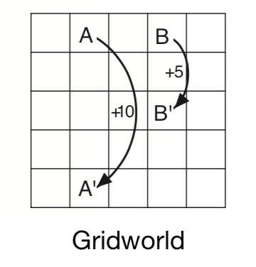
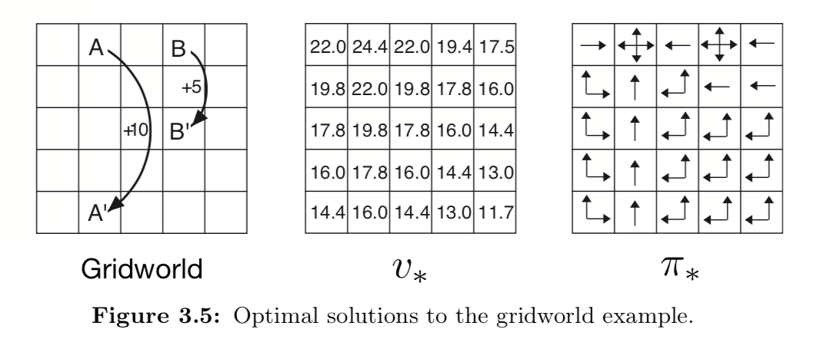
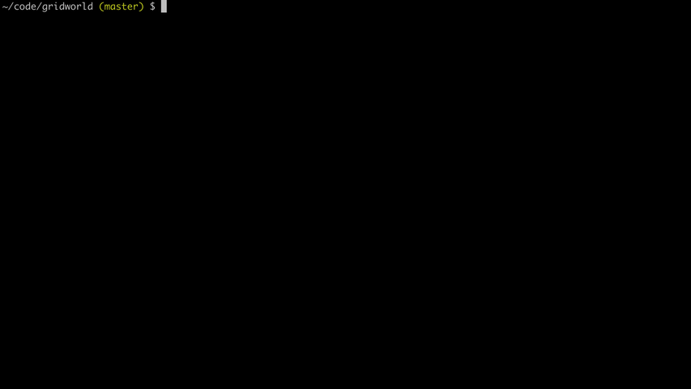
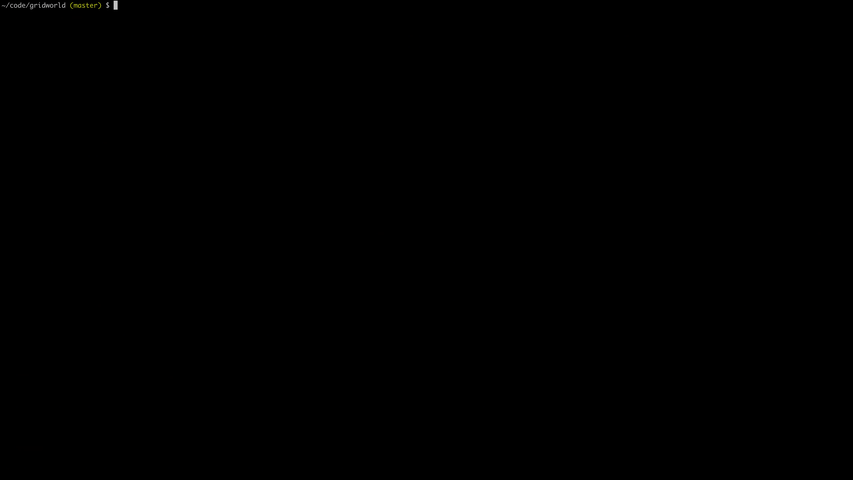

## Gridworld

An implementation of the gridworld example from Sutton and Barto's book on
Reinforcement Learning.

## Overview

In this scenario, an agent randomly moves around a grid and receives rewards
when it enters various squares of the grid. If the agent moves off the edge, it
remains where it is and receives a reward of -1. If the agent moves out of a
'special state' it receives a positive reward and 'jumps' to some other square
of the grid. All other states yield 0 reward.



This project is an attempt to use reinforcement learning to compute the optimal
value function for the grid. This can then be used to 'exploit' the maximum
possible reward over a period of time. There is usually a 'discount factor'
applied which reduces the rewards given far into the future. In this scenario,
it is fixed to 0.9, i.e. one step away yields 90% reward, two steps yields
81%, etc. Helpfully, the book tells us the right answer for the optimal value
function:



I decided to compute this from my intuition about the Bellman optimality
equation in the book. We know that the optimal value for a state is the maximum
of the reward plus the discounted value of each reachable state. For example,
the middle square's 17.8 value results from the maximum of each of its four
(adjacent) neighbours' value, multiplied by the discount factor, i.e. 19.8 * 0.9
= 17.82. Therefore, when entering a state, we can compute the return from where
we came from and take the max of this to update the **previous** state's value.
This is implemented in #receive_reward in [src/agent.rs](src/agent.rs).

This simple approach means we don't need to follow the optimal policy to
calculate the optimal value function, nor do we need to update all states each
pass. We can simply take a random walk around the grid and the value function
will eventually converge on the right answer. You can see this if you run this
application for a few seconds. I have artificially limited the number of steps
per second so you can see this happen:



([Download high-res](https://github.com/tuzz/gridworld/raw/master/images/converge.mp4))

I have also created 'large' and 'massive' environments. You can set these by
passing a command line argument:

```sh
cargo run --release large
```

Here's the algorithm running on the 'large' environment:



([Download high-res](https://github.com/tuzz/gridworld/raw/master/images/large.mp4))

## License

MIT
